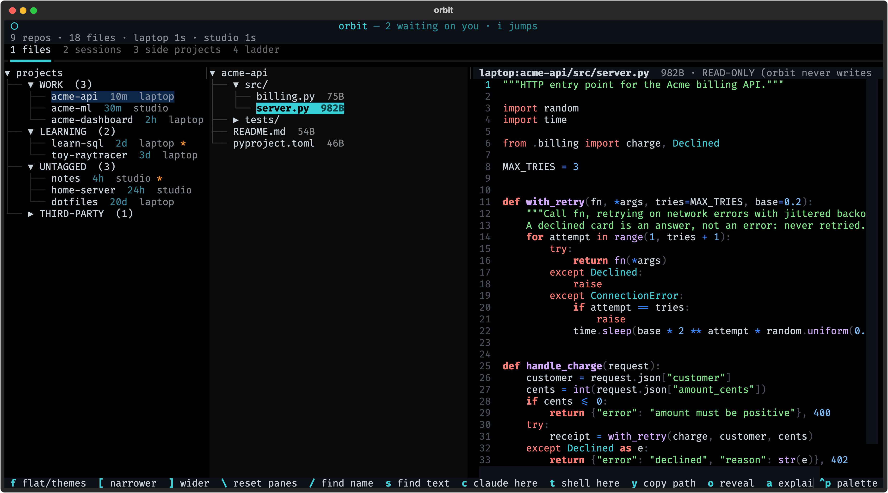
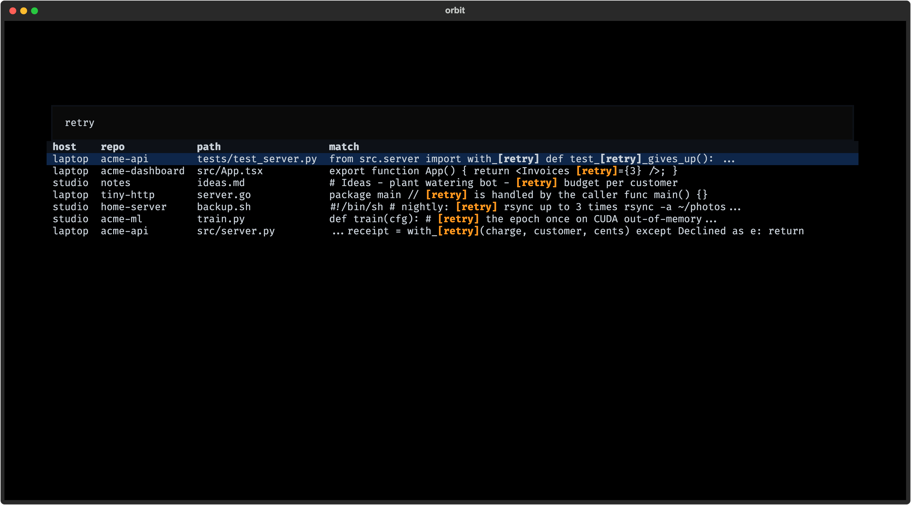
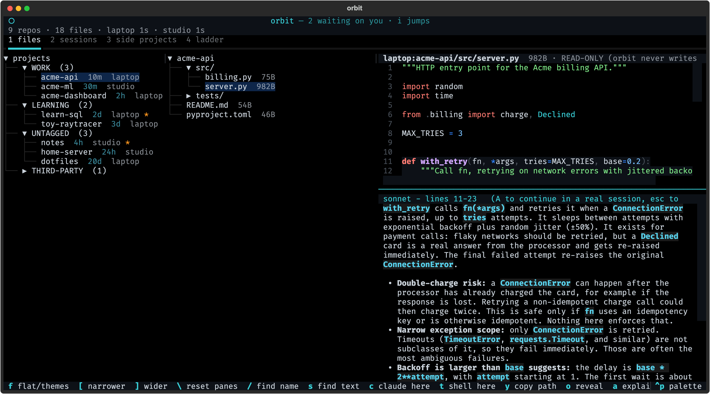
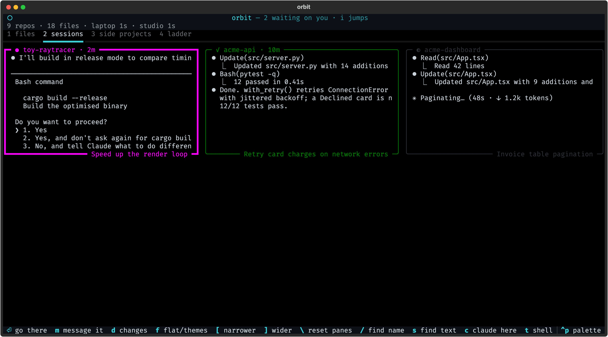
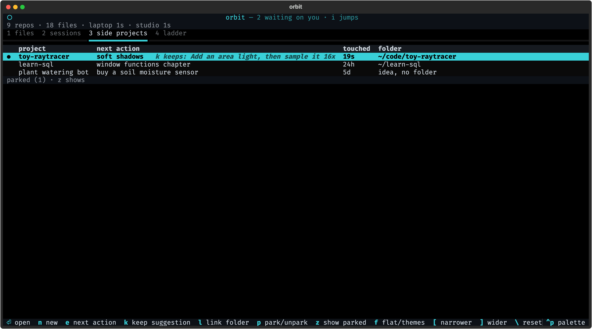
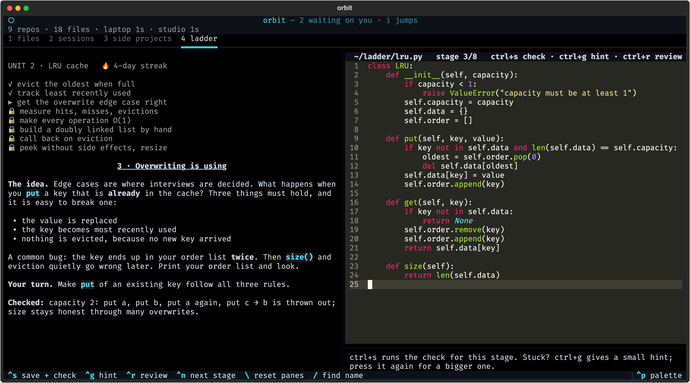
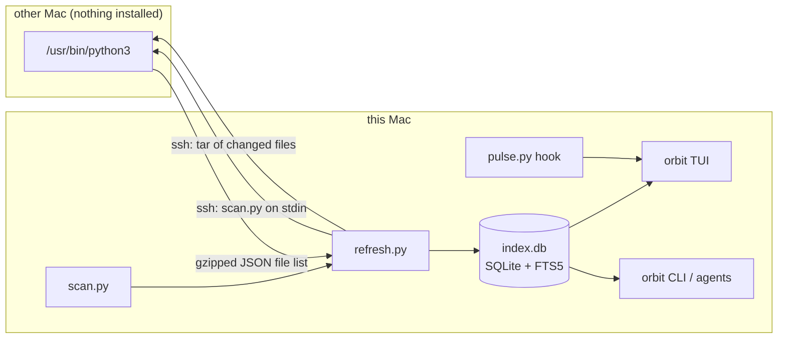

# orbit

Every file on every Mac you own, searchable from one terminal, with the Wi-Fi off.

orbit keeps one SQLite file on your laptop that holds the file list **and the full
text** of every source file in every repo on this Mac and on your other Macs (a
desktop, a home server). Search, browse and preview all run against that file,
so a repo that only exists on the other machine is as close as one that is here.
A background job refreshes it every 15 minutes: one ssh call per Mac for the file
list, then only the files that changed.

On top of the index sit four tabs: your files, your running Claude Code
sessions, your side projects, and a ladder of coding exercises.



## What you get

| | |
|---|---|
| **1 files** | Every repo on every Mac, grouped by theme, newest first. Tree, preview with syntax highlighting, search across names and contents. `c` opens Claude Code in that folder on the right Mac. |
| **explain** | Drag-select code in the preview, press `a`, and Claude explains it in a pane below. The only feature that needs the network. |
| **2 sessions** | A wall of your live Claude Code sessions, each showing the bottom of its real Terminal window. `i` jumps to the one that has waited longest on you. |
| **3 side projects** | At most five active cards, each with one next action. A finished Claude session leaves its recap as a suggestion. |
| **4 ladder** | 9 units × 8 stages of "build it yourself" exercises (key-value store → LRU cache → … → tiny GPT → RAG → agent → evals), checked by tests, with an AI interviewer that is not allowed to write code. |

### Search: names and contents, every Mac at once



### Explain: select lines, press `a`



### Sessions: who is waiting on you

Magenta = needs you (a permission prompt), green = finished, grey = working.
`m` types a one-line reply into a session without leaving orbit. It refuses
when the session shows a menu, so text can never land in a permission prompt.
`d` shows the files that session changed, diffed against the copy Claude Code
saved before its first edit.



### Side projects and the ladder





Every screenshot comes from `demo/shoot.py`, which builds a made-up two-Mac setup
in a temp folder and drives the real UI. No real repos appear in them.

## Install

You need macOS, `python3` (3.9 or newer), and ssh key access to any other Mac
you want indexed. Claude Code is optional: it powers `a`, `A`, `c`, the
sessions tab and the ladder's hints. The `gh` CLI is optional too, for the
GitHub gaps view (`g`).

```sh
git clone https://github.com/Starfish124/orbit.git ~/orbit
cd ~/orbit
./install.sh        # venv + `orbit` command + launchd job; prints the hook to paste
orbit               # the TUI; `orbit status` shows whether the first index is in
```

`install.sh` creates three things and touches nothing else:

- a venv at `~/.local/share/orbit/.venv`, holding only `textual`
- the `orbit` command at `~/.local/bin/orbit`
- a launchd job, `~/Library/LaunchAgents/dev.orbit.refresh.plist`, that runs `orbit refresh` every 15 minutes

The index lives at `~/.local/share/orbit/index.db`.

To remove orbit: `launchctl unload ~/Library/LaunchAgents/dev.orbit.refresh.plist`, then delete that plist, `~/.local/bin/orbit`, `~/.local/share/orbit` and `~/.config/orbit`.

## Configure

With no config, orbit indexes this Mac only. Copy `config.example.json` to
`~/.config/orbit/config.json` and keep the keys you need:

| key | what it does | default |
|---|---|---|
| `local` | the label this Mac's repos get | short hostname |
| `hosts` | other Macs: `{"label": "ssh host"}` | none |
| `mine` | your GitHub owners; a clone owned by anyone else is grouped as THIRD-PARTY | none (nothing is third-party) |
| `themes` | `{"THEME": ["name-prefix", …]}`; first match wins, file order is display order | none (all UNTAGGED) |
| `extra_roots` | home-relative folders to index even without a `.git`, e.g. a notes vault | none |
| `ignore` | home-relative paths never scanned, e.g. gigabytes of runtime data inside a repo | none |
| `github` | let `orbit refresh` ask `gh` for your repos, for the gaps view | `true` |

`orbit tag <repo> <THEME>` fixes one repo's theme by hand (stored in
`~/.config/orbit/tags.json`).

### Adding another Mac

1. On the other Mac: System Settings → General → Sharing → **Remote Login** on.
2. From this Mac, make key login work: `ssh-copy-id studio.local` (or add an entry to `~/.ssh/config`).
3. Check it the way orbit will use it: `ssh -o BatchMode=yes studio.local /usr/bin/python3 -V` must print a version without asking for anything.
4. Add `"hosts": {"studio": "studio.local"}` to your config and run `orbit refresh`.

Nothing is installed on the other Mac. Every cycle orbit pipes its scanner into
the other Mac's own `/usr/bin/python3` over ssh and reads the answer back.

### The sessions tab

The sessions tab reads small status files written by a Claude Code hook,
[`hooks/pulse.py`](hooks/pulse.py). `install.sh` prints the lines to merge into
the `"hooks"` object of `~/.claude/settings.json`. It does not edit that file
for you. The first time orbit reads a Terminal window, macOS asks whether your
terminal may control Terminal.app; say yes. Sessions running in another
terminal app (kitty, iTerm, tmux) get a tile but no screen.

## Keys

| key | |
|---|---|
| `1` `2` `3` `4` | switch tabs |
| `/` `s` | search file names / search contents |
| `a` | explain the selected lines (or the whole file) with Claude |
| `A` | open a real Claude session about that file and range, on the right Mac |
| `c` | Claude Code in the selected folder, any depth, on the right Mac |
| `t` | a tmux shell there |
| `y` `o` | copy the path / reveal in Finder |
| `g` | GitHub gaps: on GitHub but not cloned, local but never pushed |
| `f` | flat newest-first list ⇄ theme groups |
| `i` | select the session that has waited longest on you; `Enter` goes there |
| `n` | start a new Claude session in a folder without leaving orbit |
| drag, `[` `]`, `\` | resize panes: drag a divider, nudge, reset |
| `T` | cycle colour palette |
| `R` `q` | refresh now / quit |

In the ladder: `ctrl+s` check, `ctrl+g` hint (press again for a bigger one),
`ctrl+r` review, `ctrl+n` next stage, `esc` leaves the editor.

## CLI

Every command works without the TUI. Add `--json` where it makes sense; this is
also what you point an AI agent at instead of letting it crawl your disks.

```text
$ orbit find retry --limit 3
laptop   acme-api/tests/test_server.py
         from src.server import with_[retry] def test_[retry]_gives_up(): ...
laptop   acme-dashboard/src/App.tsx
         export function App() { return <Invoices [retry]={3} />; }
studio   notes/ideas.md
         # Ideas - plant watering bot - [retry] budget per customer

$ orbit tree acme-api
laptop:code/acme-api   WORK
  src/
    billing.py
    server.py
  tests/
    test_server.py
  README.md
  pyproject.toml
```

| command | |
|---|---|
| `orbit find <text>` | names and contents; prefix with `=` for raw FTS5 syntax (`=retry AND backoff`) |
| `orbit tree <repo> [sub]` | file tree, also for repos on other Macs |
| `orbit cat <repo>/<path>` | print an indexed file, offline |
| `orbit repos [--flat] [--stale]` | every repo, grouped or by recency; `--stale` = never pushed |
| `orbit gaps` | what is only on GitHub, what was never pushed |
| `orbit tag <repo> <THEME>` | fix a theme |
| `orbit refresh` | one index cycle by hand |
| `orbit status` | how fresh each Mac is |

## How it works



The indexer (`scan.py`, `refresh.py`, `db.py`) uses only the Python standard
library, so a broken `pip` can take out the viewer but never the index.
[docs/how-it-works.md](docs/how-it-works.md) walks through every step and the
mistakes that shaped it. Read that if you want to build something like this
yourself.

## Good to know

- **The index is a copy of your code.** Every text file under 400 KB in every
  indexed repo is stored in `index.db`. Treat that file like your home folder,
  and add anything you never want copied to `ignore`.
- macOS only: launchd, Terminal.app scripting, Finder and `pbcopy` are built in.
- Files over 400 KB and binary files are listed but have no preview.
- orbit never writes to your repos. The preview is read-only on purpose.

## Development

```sh
python3 test_orbit.py                        # 21 checks, plain asserts, no framework
/usr/bin/python3 hooks/pulse.py --selftest   # the hook, under the Python it runs with
~/.local/share/orbit/.venv/bin/python demo/shoot.py   # regenerate the screenshots
```

`test_orbit.py` also runs the ladder's content gate: every stage's reference
solution passes its own test, and the previous stage's solution fails it, so
every stage is solvable and is a real step.

## License

MIT. See [LICENSE](LICENSE).
