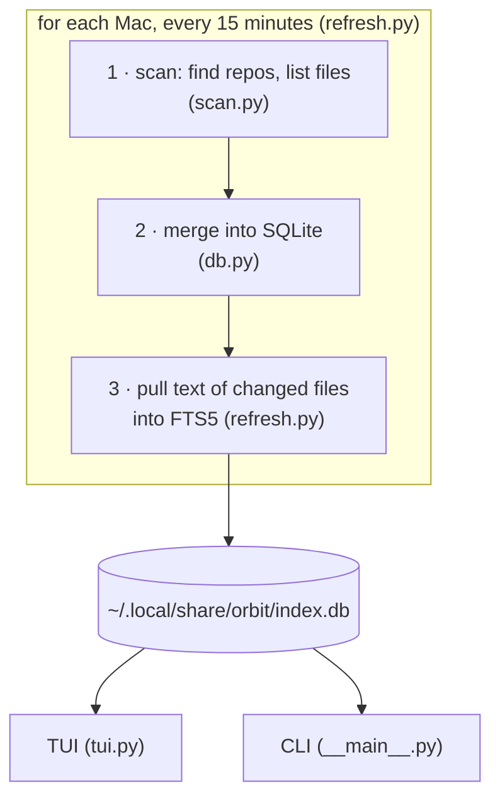

# How orbit works

This is the walkthrough for anyone who wants to understand orbit or build their
own. It follows one refresh cycle from disk to screen, then covers the parts
built on top. Each section names the file to read next.

## The shape



Five decisions carry the whole design:

1. **The scanner goes to the data, not the other way round.** One small
   stdlib-only script runs on every Mac and sends back a file list. Nothing is
   installed on the other Macs, ever.
2. **Copy only what changed.** The second cycle onwards moves a few kilobytes:
   only files whose `mtime` moved get their text pulled again.
3. **One SQLite file.** File list, file text (FTS5 full-text index), GitHub
   list and UI settings all live in `index.db`. Backups, inspection and "start
   over" are one file.
4. **The indexer has zero dependencies.** `scan.py`, `refresh.py` and `db.py`
   import only the standard library. Only the viewer needs a package
   (`textual`). A broken `pip` can break the viewer but never the index.
5. **Read-only.** orbit never writes into your repos. The preview looks like an
   editor and says READ-ONLY in its header, because people try to type in it.

## 1 · Scan (`orbit/scan.py`)

`scan(home, extra_roots)` returns one JSON document: `home`, `hostname`, and a
list of repos, each with its files as `[path, mtime, size]`.

- **Finding repos.** A breadth-first walk from `$HOME`, three levels deep,
  looking for folders that contain `.git`. A repo is a leaf: the walk never
  descends into it looking for more repos. `PRUNE_ROOT` skips top-level
  folders that hold no code and a great many files (`Library`, `Pictures`,
  `Movies`, …). `Downloads` is deliberately *not* skipped, because people
  clone into it. Folders listed in `extra_roots` are indexed even without a
  `.git`, which suits a notes vault.
- **Listing files.** A stack-based walk with `os.scandir` (no `os.walk`, no
  symlink following) that skips `IGNORE_NAMES` at any depth: `node_modules`,
  `.venv`, `dist`, `.build` and so on. `.build` earns its place: one Swift
  package's `.build` held 31,843 files (2 GB) next to 107 real ones. For
  things a name can't express ("this one subfolder of this one repo is 3 GB of
  runtime data"), `ignore` in the config holds home-relative prefixes.
- **Git facts without git.** Branch, remote and last-change time come straight
  from `.git/HEAD`, `.git/config` and the mtime of `.git/logs/HEAD`. Running
  `git status` in 60 repos would cost about 30 s per cycle, more than a dirty
  flag is worth.

The same file runs in two places. Locally, `refresh.py` imports it. On another
Mac, `refresh.py` sends the file's source over ssh stdin to that Mac's
`/usr/bin/python3`:

```sh
ssh -o BatchMode=yes studio.local /usr/bin/python3 - notes '!code/app/runtime'
```

That interpreter is the one macOS ships (3.9), so `scan.py` stays
3.9-compatible: no `match`, no `X | Y` annotations, stdlib only. The output is
gzipped JSON (`mtime=0` in the gzip header, so identical input gives identical
bytes). Because the ignore rules live in the file that travels, the two Macs
can never disagree about them.

## 2 · Merge (`orbit/db.py`, `merge_host`)

The schema is five tables: `repo`, `file`, `body` (an FTS5 virtual table whose
`rowid` is always `file.id`), `gh`, and a `meta` key-value table.

Merging one host's document is a diff:

- upsert each repo on `(host, path)`;
- compare its files to what the index has: new → insert, `(mtime, size)`
  changed → update, missing → delete the row *and its body*;
- delete repos on that host that no longer exist.

`body_mtime` is left alone on update. That is how step 3 finds work: a file
whose `body_mtime` is NULL or older than its `mtime` needs its text pulled.

Themes are decided here too (`refresh.theme_for`), highest rule first: a
manual tag, then "remote owner is not you" → THIRD-PARTY, then the name
prefixes from your config, else UNTAGGED. A foreign owner outranks the name.
Someone else's repo named like your work prefix is still someone else's.

## 3 · Pull bodies (`orbit/refresh.py`)

Only text files of 400 KB or less get a body (`scan.TEXT_EXTS`,
`scan.TEXT_NAMES`, `scan.MAX_BODY`).

- **Local:** read the file, store it.
- **Another Mac:** one `tar` stream per batch of up to 2,000 files / 24 MB.

```sh
ssh studio.local 'tar czf - --no-recursion -C "$HOME" --null -T -'
```

The file list goes in on stdin, NUL-separated, so names with spaces survive.
The tar comes back on stdout and is read as a stream (`tarfile` mode `r|gz`)
straight into FTS5. `"$HOME"` is expanded by the remote shell, so you never
configure the other Mac's home folder.

Three details here each cost real debugging time:

- **`--no-recursion` is load-bearing.** Without it, any listed path that is a
  directory makes tar pack the whole subtree, and a streaming reader has to
  decompress past every unwanted member. Leaving it out took the body pull
  from 4 s to 67 s per cycle.
- **No trailing NUL.** bsdtar reads a final empty entry as `""` and tries to
  pack the whole `-C` directory.
- **Record failures as attempts.** A file that is binary despite its
  extension, or that vanished since the scan, gets `body_mtime` set anyway.
  Otherwise it is requested again every cycle forever. The flip side: bodies
  are only pulled from Macs that answered the scan *this* cycle. An
  unreachable Mac would make every pending file look missing.

A refresh takes a non-blocking `flock`, so the launchd job and a manual
`orbit refresh` never run on top of each other. In steady state a cycle takes
1–2 s.

## 4 · Search (`orbit/db.py`)

Name search is `LIKE` on paths. Content search is FTS5 with the `unicode61`
tokenizer and `snippet()` for the match context.

User text goes through `fts_query()`, which wraps it in quotes as a phrase.
Unquoted, FTS5 reads `-` as NOT and `a:b` as a column filter, so
`orbit find hash-chained` once died with "no such column: chained". Prefix a
query with `=` to get raw FTS5 syntax (`=retry AND backoff`, `=back*`).

One display trap: `snippet()` marks matches as `[word]`, and Rich (which
Textual uses) reads a bracketed word in a plain string as a style tag and
drops it. Search cells are built as `Text` objects, never markup strings. The
same applies to tree labels: `[id]/` is a real folder name in Next.js.

## 5 · The TUI (`orbit/tui.py`)

Textual, three panes on the files tab, with dividers you can drag (Textual
ships no splitter, so `Divider` is about 30 lines of mouse capture).
`clamp_pane()` keeps the preview at least 24 columns wide. Widths are saved as
the size you **asked for**, never the size the terminal allowed. Otherwise one
session in a small window shrinks the layout for good.

The preview is a read-only `TextArea`. Textual bundles about 15 tree-sitter
grammars, so `language_for()` maps `.ts`/`.tsx` to javascript and anything
unknown to plain text, never to an error. The `[syntax]` extra of `textual`
is required: without it the code renders silently unhighlighted.

**Explain (`a`)** sends the selected lines, plus the host, repo, path and line
range, to `claude -p --model sonnet` on a worker thread. The header ticks
seconds while it waits, because a 20–30 s silence reads as a hang. It is the
one feature that needs the network, and it fails fast and says so.

**Jumping (`c`, `t`, `A`)** has one rule: a command run over
`ssh other-mac <cmd>` gets `PATH=/usr/bin:/bin:/usr/sbin:/sbin`, where neither
`tmux` nor `claude` exists. Every remote command therefore goes through
`zsh -lc`, with two layers of quoting: one for the path, one for the whole
argument (`jump.remote_cmd`, tested by actually running it). A local `c`
opens a *new* Terminal window. Running Claude inside orbit's own terminal
would freeze orbit and give the session orbit's tty.

## 6 · Sessions (`hooks/pulse.py`, `orbit/sessions.py`)

The Claude Code hook `pulse.py` runs on ten events (SessionStart,
UserPromptSubmit, PostToolUse, Notification, Stop, …) and keeps one JSON file
per session in `~/.config/orbit/pulse/`: state (busy / idle / needs_you /
error / ended), the session's pid, cwd, title, and `waiting_since`. It only
tails the last 64 KB of the transcript, so every hook call is O(1).

- **Waiting.** Two kinds count: `needs_you` (a permission prompt or a
  question) and *finished* (`Stop` fired, `waiting_since` set). Claude Code's
  `idle_prompt` notification is not a signal: it fires about 60 s after Stop.
- **Dead sessions.** The hook only notices a crash when another hook fires, so
  orbit checks each pid itself (`os.kill(pid, 0)`).
- **The screens.** One AppleScript call reads `contents of tab i of window w`
  for every session's tty: the visible text only, no scrollback. Tabs are
  addressed by index, because a `repeat with t in tabs` loop variable is a
  reference that `contents of t` dereferences instead of reading. The
  separators are `\x02` and `\x03`. `\x1e`/`\x1f` look ideal, but Python's
  `strip()` treats them as whitespace and eats the first one.
- **Replying (`m`).** Text is typed only into a screen that shows Claude's
  normal input box (a `❯` line between the last two rules), never into a
  session that needs you, and the screen is read again right before sending.
  A permission menu must never receive keystrokes.
- **What changed (`d`).** Claude Code backs up every file before its first
  edit, for `/rewind`, at `~/.claude/file-history/<session>/<sha256(path)[:16]>@v1`.
  orbit lists the files from the transcript's Edit/Write tool calls and diffs
  each against that backup. Edits made through Bash leave no backup and are
  not seen.

## 7 · Side projects and the ladder

**Side projects** (`sideprojects.py`) are a JSON list with a hard cap of five
active cards. Activating a sixth parks the one touched longest ago. A card
with a folder picks up live sessions running in it. When one finishes, its
recap is offered as the next action (`k` keeps it).

**The ladder** (`ladder.py`, `ladder/<unit>/`) is lessons (`NN.md`) plus plain
assert tests (`NN_test.py`). Each stage's test checks the whole contract so
far, so it doubles as a regression test. Your code is one growing file in
`~/ladder/`. A check runs in a fresh process, in a temp folder, in its own
session group, with a 5 s limit, so an infinite loop is killed and reported
as one. Hints and reviews come from `claude -p` with no tools. Any reply
containing code is withheld (`leaks_code`). The content gate in
`test_orbit.py` keeps the course honest: stage N's reference solution passes
stage N, and stage N−1's fails it.

## Build your own: the order that works

1. `scan.py` for one machine: find repos, list files, print JSON. Test it on
   your own home. You will discover your own `.build` folders.
2. `db.py`: the four tables and the merge diff. Run a scan twice and check
   that the second merge reports zero changes.
3. Bodies plus FTS5, local only. Now `orbit find` is useful.
4. A second machine over ssh. Get BatchMode, the login-shell PATH and the tar
   stream right here.
5. Only then a UI. Everything before this works from the CLI, which is also
   what you hand to coding agents.

## Gotchas, in one place

| symptom | cause | fix |
|---|---|---|
| a body pull takes 60 s+ | a directory in the tar list | `tar --no-recursion` |
| tar packs your whole home | trailing NUL in the `-T -` list | join with NUL, no terminator |
| `tmux: command not found` over ssh | non-login ssh PATH | wrap in `zsh -lc` |
| `chat-bot.git` becomes `chat-bo` | `rstrip(".git")` strips characters, not a suffix | `if u.endswith(".git"): u = u[:-4]` |
| search for `a-b` errors | FTS5 syntax in user text | quote as a phrase (`fts_query`) |
| matched word missing from results | Rich markup eats `[word]` | build cells as `Text` |
| layout stays tiny after a small window | saved the clamped width | save the requested width |
| first tab's screen missing | `strip()` ate a `\x1e` separator | use `\x02`/`\x03` |
| a timing test fails on a laptop | macOS coalesces timers; `sleep(0.03)` can take 0.1 s | compare against a measured sleep |
